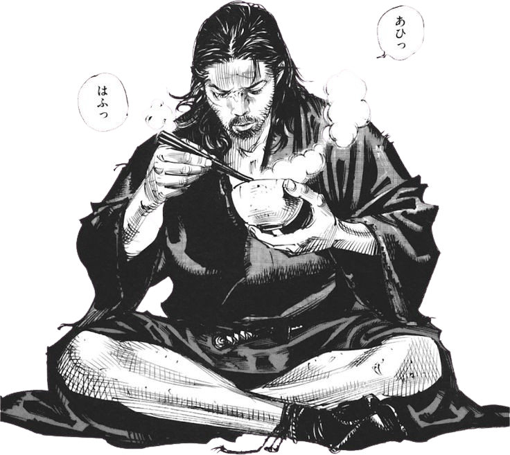
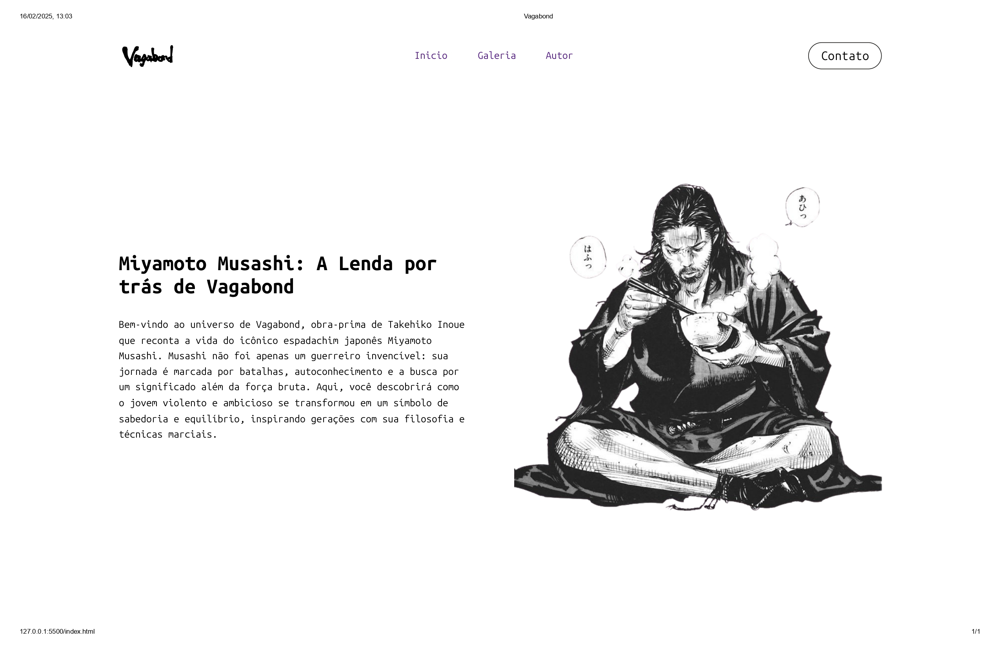

# 🗡️ Vagabond - Miyamoto Musashi

  

> *"Na vida, não há derrota para quem domina a si mesmo."* - Miyamoto Musashi

Site dedicado à obra-prima **Vagabond** de Takehiko Inoue, explorando a jornada filosófica e marcial do lendário espadachim Miyamoto Musashi.

## 🎯 Features

- ✨ Layout moderno com Flexbox
- 🖼️ Ilustração em alta qualidade do Musashi
- 📖 Tipografia temática com Playfair Display
- 🧱 Estrutura semântica HTML5
- 🎨 Design responsivo (em desenvolvimento)

## 🛠️ Tecnologias

## 🖥️ Preview

Tela Inicial:

Galeria:

Area de Contato:

## 🌌 Roadmap

- [x] Seção inicial
- [ ] Biografia completa
- [ ] Galeria de personagens
- [ ] Timeline das batalhas
- [ ] Modo noturno

  ✍️ Feito com ❤️ por Gabriel Correa

